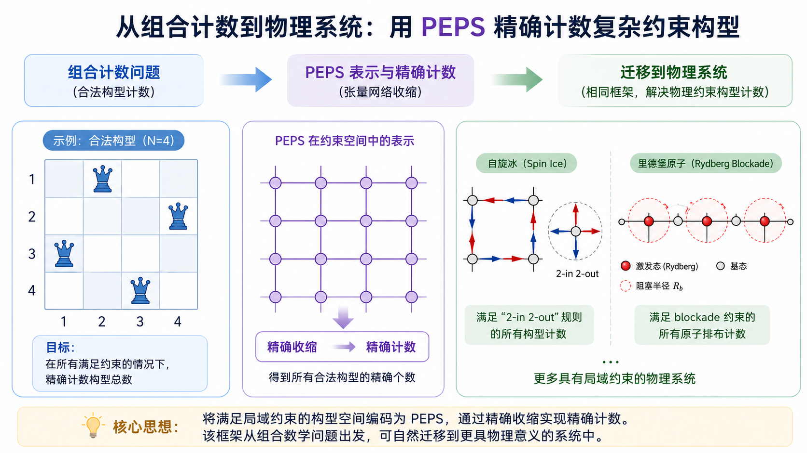

# 从组合计数到物理系统：用 PEPS 精确计数复杂约束构型

## 问题背景

$N$ 皇后问题是……（补全定义），是 NP 的。（补充一些组合学上的意义）

该问题的传统 SOTA 算法是基于 bitmask 的 bitboard DFS，目前最前沿的计算结果是用几个月得到了 $Q(27)$。（参考文献 Liu、Liao、Wang 在
*Statistical mechanics of the N-queens problem*（arXiv:2605.10326v2）
Sec. VI）除了 DFS 算法，$N$ 皇后问题也可以写成一个 PEPS 内积问题：构造编码了 $N$ 皇后约束规则的，具有 17 个非零元的 rank-9 张量局域张量 $B$，组成 $N \times N$ 的 PEPS，再和直积态 $(\ket 0 + \ket 1)^{\otimes N}$ 做内积，即可得到 $N$ 皇后问题的合法构型数 $Q(N)$。这种框架也可以迁移到其他类似的具有约束条件的物理问题中，例如自旋冰和 Rydberg blockade 问题，将 ice-rule 和阻塞条件编码进 PEPS 中，来研究其基态简并度或者最大独立集大小（两个参考文献，从故事1.md里找，有一个自旋冰的，有一个 Rydberg 的。）。

我们的研究目标是从最直接的逐行 PEPS 收缩出发，由 AI agent 自行探索能够加速算法运行的优化途径，探究算法的最优实现方案，以及计算出更大 $N$ 皇后问题的可能性。

## 研究结论

AI agent 在尝试了 60 个优化方向后，得到的结果是：对于该稀疏 PEPS 收缩，仅仅通过机械的稀疏性编译、冗余消除、代数化简和局部常数优化，这个高维张量网络的精确收缩最终在底层机器码上“自然演化”成了经典的位运算 DFS 算法；这反映了针对强约束组合问题的 PEPS 收缩，其本质就是状态空间搜索。

在 agent 的尝试过程中，通用张量网络的常用优化手段（如 ZDD/ADD 决策图、朴素 Wavefront 排序、部分 D4 对称性、基于通用 treeSA 的路径搜索、甚至底层的 AVX2 SIMD）在面对高度稀疏且强约束的 N-Queens 时会失效，大部分都带来了比较明显的负收益。treeSA 优化后的收缩路径，会得到更大的中间张量，在收缩用时和峰值内存占用上都不优于直接做逐行精确收缩。

（放图，见 docs/issue34_research_report.html（在 origin/agent/issue34-html-report 中，不在 main branch），耗时 vs. N，RSS vs. N 两张图。查原始数据用 matplotlib 或者 seaborn 重新画图。记得外推到 $N=28$。虽然这个算法目前看还不能在可接受的时间里计算出 $Q(28)$，但是在物理上的启示是可用的）

这启示我们，对于这种带有“强局部约束”的系统，在使用 PEPS 方法研究时，应该抛弃使用针对网络拓扑的图论算法来优化收缩路径，和标准的矩阵乘法与 SVD，必须开发基于数据依赖的动态路径搜索工具，减少割线上实际存活的非零状态数，并尽可能将张量运算优化成位运算或稀疏自动机。

我们还探究了，如果有截断地进行收缩，会带来多大的误差。结果表明，在 $N=14$ 时，即使保留到 $\chi = 128$，得到的结果仅有正确结果的……（查原始数据补全）；而在通常的 PEPS 研究中，$\chi$ 的取值都会比较小，说明在这种问题上，使用传统的 PEPS 方法可能会严重低估基态简并度，造成基态性质结果不准确。而使用这种精确收缩的 PEPS 框架，不仅只需要比较小 bond dimension 的两个 PEPS 做内积，而且其收缩时间也是可以接受的；在本问题中，精确收缩 $20 \times 20$ 的结果也只需要……（查原始数据补全）。

（放图，见 docs/issue34_research_report.html（在 origin/agent/issue34-html-report 中，不在 main branch）。查原始数据用 matplotlib 或者 seaborn 重新画图。纵轴换成计算结果，用虚线标注正确的结果）

## 各优化方向分类与总结

根据 REPORT.md，nqueens_issue34_autoresearch_plan.md，docs/issue34_research_report.html（在 origin/agent/issue34-html-report 中，不在 main branch），审稿意见.md，审稿意见1.md，总结1.html，总结2.html生成。

## 完整技术报告

根据 REPORT.md，nqueens_issue34_autoresearch_plan.md，docs/issue34_research_report.html（在 origin/agent/issue34-html-report 中，不在 main branch），审稿意见.md，审稿意见1.md，总结1.html，总结2.html生成。